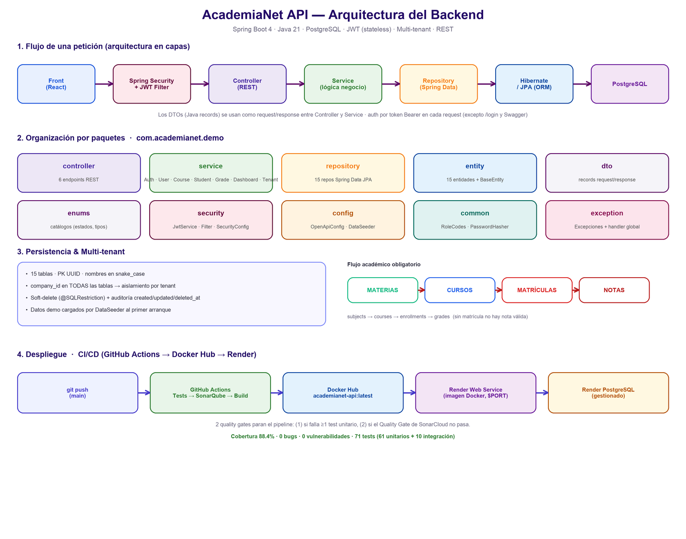

# Arquitectura — AcademiaNet API (Backend)



API REST **monolítica en capas**, *stateless*, con **multi-tenancy de esquema compartido**.
Construida con **Spring Boot 4 · Java 21 · PostgreSQL**, autenticación **JWT** y
desplegada como contenedor Docker en Render mediante CI/CD (GitHub Actions + SonarCloud).

---

## 1. Estilo arquitectónico

- **Monolito por capas** (Controller → Service → Repository → Entity). No microservicios.
- **Stateless**: no hay sesión en servidor; la identidad viaja en el JWT (`Authorization: Bearer`) en cada request.
- **Multi-tenant (shared DB / shared schema)**: una sola base de datos donde **cada tabla lleva `company_id`** como discriminador de tenant.

## 2. Flujo de una petición

```
HTTP → [Filtro JWT / Spring Security] → Controller → Service → Repository → Hibernate/JPA → PostgreSQL
                                          ↑ DTOs (records) ↓
```

1. **`JwtAuthenticationFilter`** valida el token `Bearer` y puebla el `SecurityContext` (rutas públicas: `/api/auth/login`, `/v3/api-docs/**`, `/swagger-ui/**`).
2. **Controller** (`@RestController`) recibe/devuelve **DTOs** (Java `records`), nunca entidades.
3. **Service** (`@Service`, `@Transactional`) contiene la lógica y mapea entidad ↔ DTO.
4. **Repository** (Spring Data JPA) accede a datos; el soft-delete se aplica con `@SQLRestriction`.
5. **Hibernate** mapea las entidades a **PostgreSQL**.

## 3. Organización por paquetes (`com.academianet.demo`)

| Paquete | Responsabilidad |
|---------|-----------------|
| `controller` | 6 endpoints REST |
| `service` | Lógica: Auth, User, Course, Student, Grade, Dashboard, Tenant |
| `repository` | 15 repositorios Spring Data JPA |
| `entity` | 15 entidades + `BaseEntity` (PK UUID + auditoría) |
| `dto` | `records` de request/response |
| `enums` | Catálogos (estados, tipos, modalidades…) |
| `security` | `JwtService`, `JwtAuthenticationFilter`, `SecurityConfig` |
| `config` | `OpenApiConfig` (Swagger), `DataSeeder` (datos demo) |
| `common` | `RoleCodes` (mapeo rol front↔backend), `PasswordHasher` |
| `exception` | Excepciones + `@RestControllerAdvice` global |

## 4. Persistencia & Multi-tenant

- **15 tablas**, PK **UUID**, nombres en **snake_case** (idioma inglés).
- **`company_id` en TODAS las tablas** → aislamiento entre organizaciones (tenants).
- **Soft-delete** con `@SQLRestriction("deleted_at IS NULL")` + `@SQLDelete`.
- **Auditoría** universal: `created_at`, `updated_at`, `deleted_at` (en `BaseEntity`).
- **Flujo académico obligatorio:** `subjects → courses → enrollments → grades`
  (sin matrícula no existe una nota válida).
- **`DataSeeder`** carga datos demo (empresa, roles, usuarios, cursos, notas) en el primer arranque.

## 5. Seguridad (JWT, stateless)

- Login (`/api/auth/login`) valida credenciales y emite un **JWT** firmado (HMAC).
- El token incluye `sub` (userId), `email`, `role`, `companyId`, `name`, `exp`.
- El resto de `/api/**` exige token válido → `401` si falta o es inválido.
- CSRF deshabilitado (correcto para API stateless con token en header, no cookies).
- Contraseñas hasheadas (no en texto plano).

## 6. Despliegue y CI/CD

```
git push (main) → GitHub Actions (Tests → SonarQube → Build) → Docker Hub → Render Web Service + Render PostgreSQL
```

- **Pipeline con 2 quality gates** que detienen el flujo:
  1. Falla si **≥ 1 test unitario** falla (`mvn clean verify`).
  2. Falla si el **Quality Gate de SonarCloud** no pasa (`-Dsonar.qualitygate.wait=true`).
- Imagen publicada en Docker Hub: `patoprogramador/academianet-api:latest`.
- Render construye el `Dockerfile` (multi-stage) y escucha en `$PORT`; blueprint en `render.yaml`.

**Métricas de calidad:** cobertura **88.4 %**, 0 bugs, 0 vulnerabilidades, hotspots revisados,
**71 tests** (61 unitarios + 10 de integración).

## 7. Stack

| Capa | Tecnología |
|------|------------|
| Lenguaje / Framework | Java 21 · Spring Boot 4 (Web MVC + Data JPA) |
| ORM | Hibernate 7 (soft-delete, `@SQLRestriction`) |
| Base de datos | PostgreSQL 16 (H2 en memoria para tests) |
| Seguridad | Spring Security + JWT (jjwt) |
| Docs | springdoc-openapi (Swagger UI / OpenAPI 3.1) |
| Build / Contenedor | Maven · Dockerfile multi-stage · docker-compose |
| CI/CD | GitHub Actions · SonarCloud · Docker Hub · Render |

> Diagrama regenerable con el script en `scratchpad/draw_arch.py` (usa Pillow). El PNG vive en `docs/architecture.png`.
