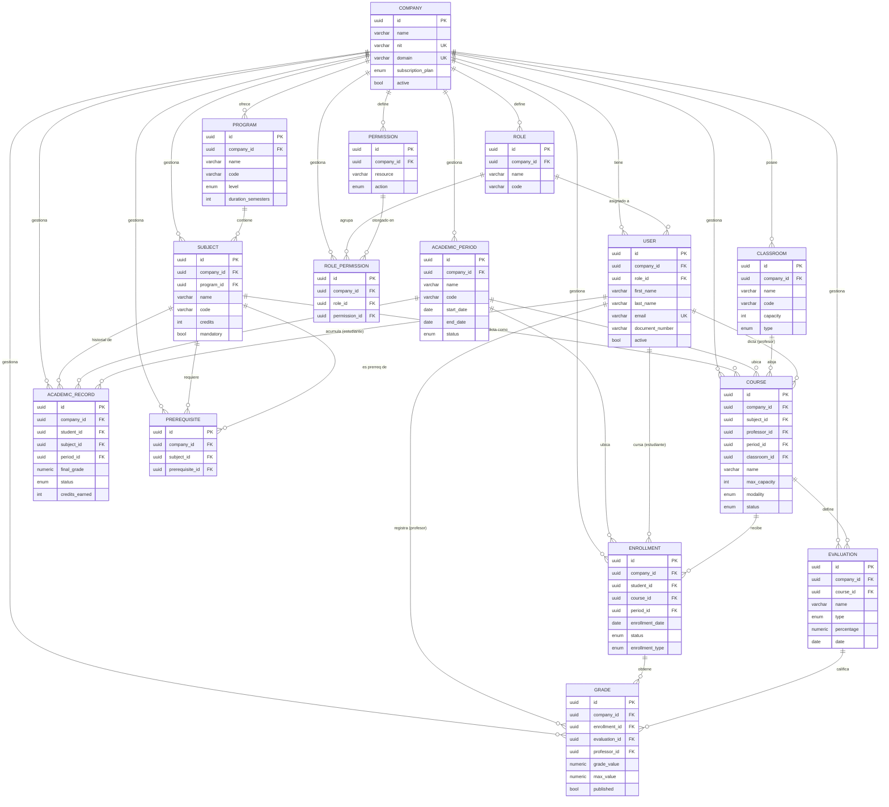

# Diagrama entidad-relación — AcademiaNet

Sistema académico **multi-tenant**. La tabla `companies` es la raíz del tenant;
todas las demás tablas la referencian mediante `company_id`.

Toda entidad hereda de `BaseEntity`, por lo que además de las columnas mostradas,
cada tabla tiene: `id` (UUID, PK), `created_at`, `updated_at` y `deleted_at`.
El campo `deleted_at` implementa **soft-delete** (`@SQLDelete` + `@SQLRestriction`).

Notación: `||--o{` = uno-a-muchos (crow's foot) · `PK` primaria · `FK` foránea · `UK` única.

